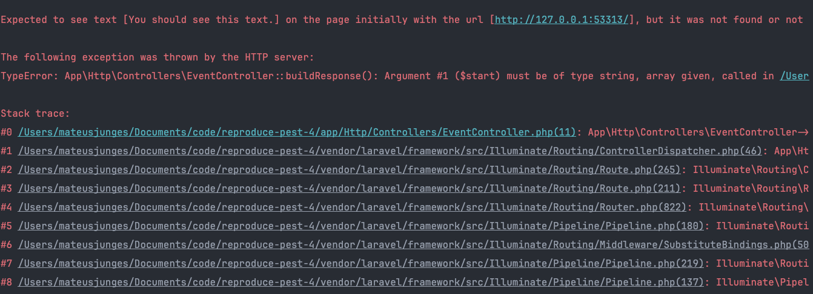
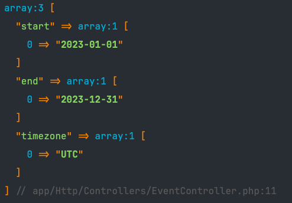
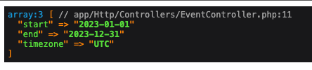

## Reproduces error when browser testing with Pest 4

When navigating to the `/` route, I see the `You should see this text` message as expected.
However, when I try to visit the page using Pest 4 browser testing, I get a server error saying that `$start`, `$end` and `$timezone` should be strings, and we are passing an array.

When I `dd($request->all()` in the `EventController` during browser testing, this is what I see:

This is the expected output and the one I get when `dd($request->all()` in the `EventController` during a normal visit:

